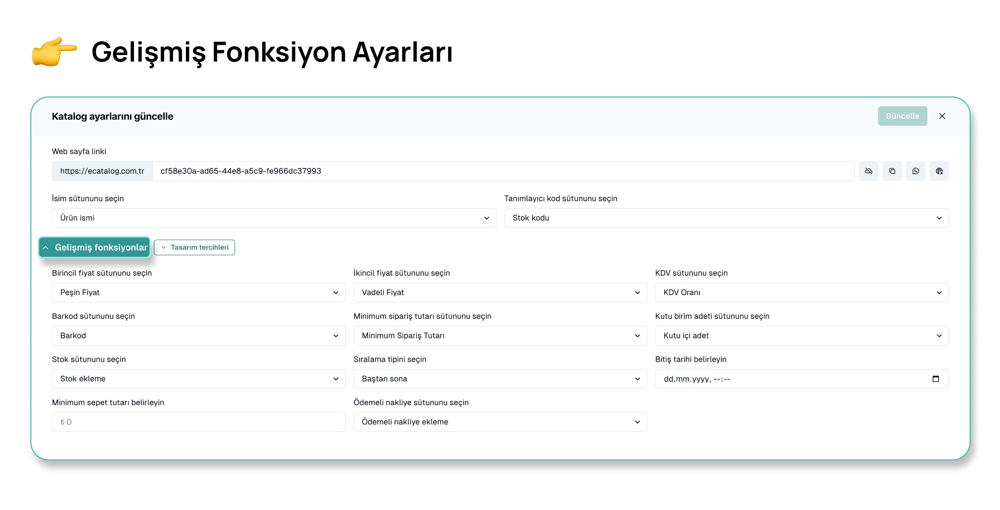

# Gelişmiş Fonksiyon Ayarları

**Gelişmiş Fonksiyonlar**

<figure><figcaption>
Gelişmiş Fonksiyon Ayarları
</figcaption></figure>

Bu bölümde, katalogunuzun işlevselliğini artıracak çeşitli ayarları yapabilirsiniz:

<figure><figcaption>
Birincil Fiyat Sütunu
</figcaption></figure>

* **Birincil Fiyat Sütunu:** Ürünlerin ana fiyatını belirleyen sütunu seçin. (Örneğin, Peşin Fiyat)

<figure><figcaption>
İkincil Fiyat Sütunu
</figcaption></figure>

* **İkincil Fiyat Sütunu:** Alternatif fiyat bilgisini içeren sütunu seçin. (Örneğin, Vadeli Fiyat)

<figure><figcaption>
KDV Sütunu
</figcaption></figure>

* **KDV Sütunu:** Ürünlerin KDV oranlarının bulunduğu sütunu seçin. (Opsiyonel)

<figure><figcaption>
Barkod Sütunu
</figcaption></figure>

* **Barkod Sütunu:** Ürünlerin barkod bilgilerinin bulunduğu sütunu seçin. (Opsiyonel)

<figure><figcaption>
Minimum Sipariş Tutarı Sütunu
</figcaption></figure>

* **Minimum Sipariş Adeti:** Ürünlerin minimum sipariş miktarının bulunduğu sütunu seçin. (Opsiyonel)

<figure><figcaption>
Kutu Birimi Adeti Sütunu
</figcaption></figure>

* **Kutu Birimi Adeti:** Ürünlerin kutu içi adet bilgisinin bulunduğu sütunu seçin. (Opsiyonel)

<figure><figcaption>
Stok Sütunu
</figcaption></figure>

* **Stok Sütunu:** Ürünlerin stok bilgilerinin bulunduğu sütunu seçin. (Opsiyonel)

<figure><figcaption>
Sıralama Tipi Sütunu
</figcaption></figure>

* **Sıralama Tipi:** Ürünlerin sıralama tipini belirleyin. Baştan sona veya sondan başa doğru. (Opsiyonel)

<figure><figcaption>
Katalog Bitiş Tatrihi Sütunu
</figcaption></figure>

* **Katalog Bitiş Tarihi:** Katalogun sona ereceği tarihi belirleyin. (Opsiyonel)&#x20;

<figure><figcaption>
Minimum Sepet Tutarı Sütunu
</figcaption></figure>

* **Minimum Sepet Tutarı:** Minimum sipariş tutarını belirleyin. (Opsiyonel)

<figure><figcaption>
Ödemeli Nakliye Sütunu
</figcaption></figure>

* **Ödemeli Nakliye:** Ödemeli nakliye seçeneğini ekleyin. (Opsiyonel)

